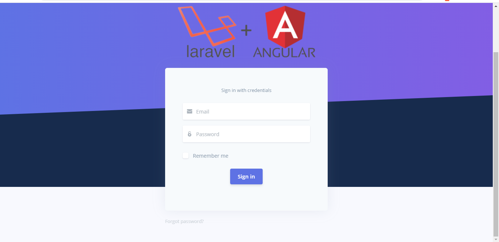
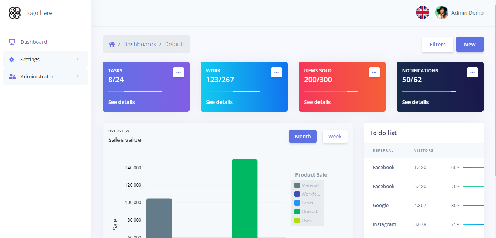
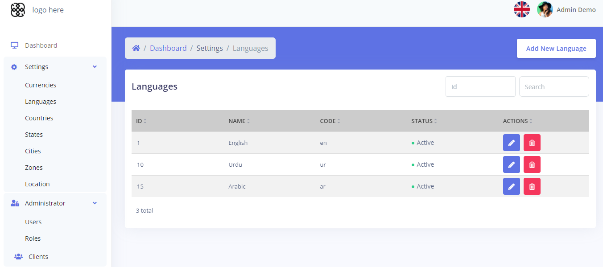

	

# Laravel + Angular + Ngrx (State Management) + i18n Admin Template
Quick start With Admin Template for Laravel 8.0 + Angular 10.0 With NGRX projects with JWT auth.

## Includes:

### Front-end:
- Angular CLI boilerplate files
- JWT authentication service
- Login components
- i18n

	

	

	

### Back-end:
- Composer build file
- Boilerplate files
- JWT authentication

## Server
- Go to `Server` folder and run `composer install` to install dependencies.

- Set your DB connections in `.env`

- run `php artisan key:generate` to generate app key.

- run `php artisan serve`

docker exec -i vue-starter-db -c "PGPASSWORD=123456 psql -U mydata -h localhost -p 5432 mydata" < melody_pre_20230129.sql 

cat lara_angular.sql | docker exec -i vue-starter-db bash -c "/usr/bin/mysql -u root --password=123456 antrian"

- import sql file placed in root directory

- In migrations, the default user is created for which username is **"admin@gmail.com"** and password is **"123456"**.

## frontend
- Open *Client* folder in terminal/console and run `npm install` to install all dependencies.

- Add URL to your local server to  `/Client/src/environments/environment.ts`.

- Run `ng serve` for a dev server. Navigate to `http://localhost:4200/`. The app will automatically reload if you change any of the source files.

## License: [MIT](https://opensource.org/licenses/MIT)
